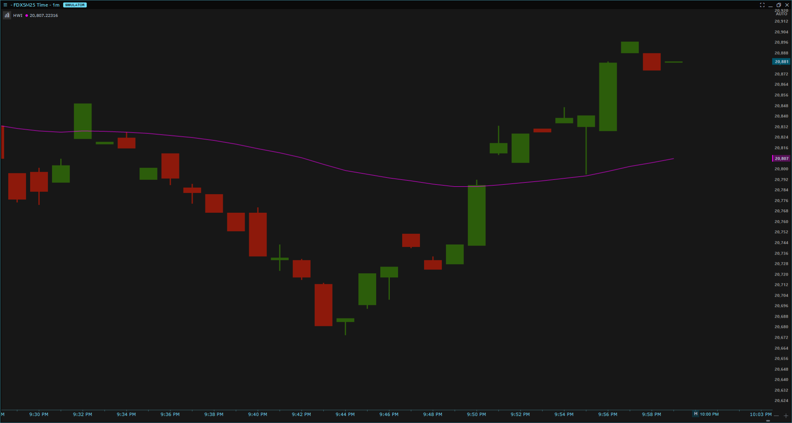

# Hello World Indicator Quantower

# Setup

1. Open the `.csproj` file: [HelloWorldIndicator/HelloWorldIndicator.csproj](./HelloWorldIndicator/HelloWorldIndicator.csproj)
2. Update all references to Quantower libraries to match your installation path.
   - In particular, ensure the reference to `TradingPlatform.BusinessLayer.dll` is correct.
3. Verify that the `OutputPath` points to your Quantower `Scripts/Indicators` folder for both `Debug` and `Release` configurations.

# Result

